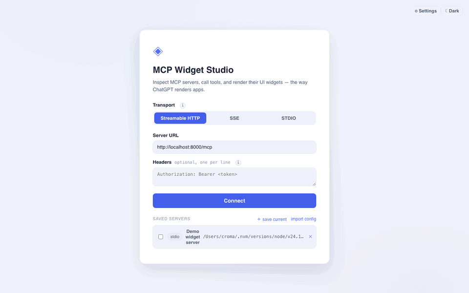
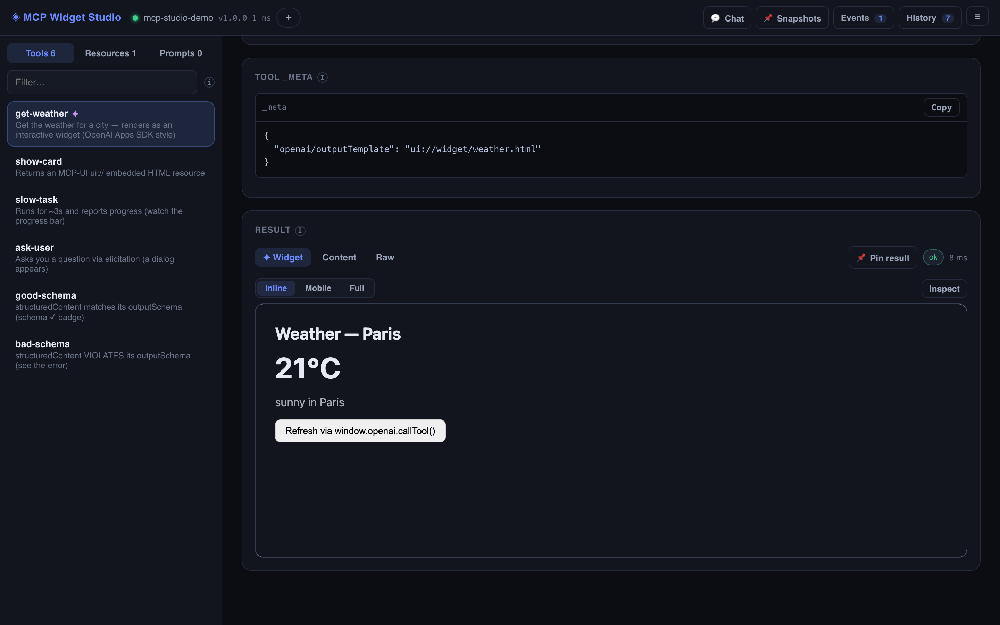
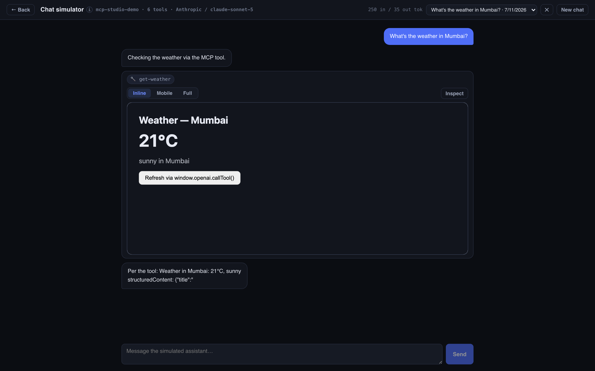

# MCP Studio

[](https://www.npmjs.com/package/mcp-widget-studio)
[](LICENSE)

**Web-based MCP client with a widget renderer — inspect servers, call tools, and
render their UIs the way ChatGPT renders apps.**

```bash
npx mcp-widget-studio --demo
```



| Tool result as a live widget | Chat simulator: an LLM drives your tools, widgets inline |
|---|---|
|  |  |

MCP Studio does everything you'd expect from an inspector — connect to any
[Model Context Protocol](https://modelcontextprotocol.io) server, browse its
tools / resources / prompts, call tools from auto-generated forms, watch the
request history — and adds the piece inspectors are missing: when a tool
carries UI metadata, its result is rendered as a **live, interactive widget**
in a sandboxed iframe, exactly like apps onboarded to ChatGPT. Both major
conventions are supported: the **OpenAI Apps SDK** (`window.openai` bridge)
and **MCP-UI** (`ui://` embedded resources).

---

## Contents

- [Features](#features)
- [Architecture](#architecture)
- [Getting started](#getting-started)
- [Using the app](#using-the-app)
- [Widget rendering](#widget-rendering)
  - [OpenAI Apps SDK convention](#openai-apps-sdk-convention)
  - [MCP-UI convention](#mcp-ui-convention)
  - [Building a widget-enabled server](#building-a-widget-enabled-server)
- [Proxy API reference](#proxy-api-reference)
- [Project structure](#project-structure)
- [Troubleshooting](#troubleshooting)
- [Security notes](#security-notes)

---

## Features

| Area | What you get |
|---|---|
| **Connect** | Streamable HTTP, SSE, and STDIO transports; custom HTTP headers (e.g. `Authorization`); **OAuth** for protected remote servers (discovery, dynamic client registration, PKCE — authorize in a browser tab, tokens cached per server URL for reconnects); recent connections remembered |
| **Tools** | List with search; title/description; annotation chips (read-only / destructive / idempotent / open-world with ✓ / ✕ / undeclared states); input schema as a generated form *or* raw JSON; tool `_meta` viewer; optional request `_meta` key-value pairs sent with `tools/call` |
| **Widgets** | Tools with UI metadata get a ✦ badge and a **Widget** result tab rendering the live UI; widget-initiated `callTool` round-trips through the real session; fullscreen mode; auto-height |
| **Results** | Widget / Content / Raw tabs; text, images, audio, embedded resources, resource links, `structuredContent`; per-call duration and error display |
| **Resources** | List + read with text/HTML/binary display; **resource templates** with `{variable}` inputs and live URI expansion |
| **Prompts** | List, argument form, `prompts/get` result view |
| **History** | Inspector-style bottom drawer with two views: **Requests** (every MCP operation, including widget-initiated calls, with request/response JSON, ↻ replay, ✎ load-into-form, copy-as-curl) and **Raw frames** (every JSON-RPC message on the wire in both directions, including the initialize handshake); session export as JSON |
| **Events** | Live server notifications — `notifications/message` log entries formatted with level/logger, `tools/list_changed` auto-refreshes, resource-updated notices — plus widget actions; log-level selector sends `logging/setLevel` |
| **Multi-server** | Connect several MCP servers at once (checkbox-select saved servers, or ＋ in the top bar). A dropdown switcher shows per-server health/latency and switches the workspace focus; connecting an already-connected server just refocuses it. Disconnecting one leaves the rest connected, and each server auto-reconnects independently |
| **Chat simulator** | A separate Chat screen where a real LLM acts as the host — across **all** connected servers at once: tools are namespaced per server (`my-server__tool`), the model picks whichever fits the request, calls are routed to the owning server, and results render as widgets inline in the transcript — a local ChatGPT-developer-mode preview. Conversations **auto-save and resume** (survive navigation and reloads) with a picker to switch between saved chats |
| **Any LLM provider** | No framework needed: Settings has provider presets (Anthropic, OpenAI, OpenRouter, Groq, Mistral, local Ollama, or any custom OpenAI-compatible base URL). Models are **listed dynamically** from the provider's `/models` endpoint; the proxy speaks both the Anthropic Messages API and the OpenAI Chat Completions API and normalizes tool calling between them |
| **Widget dev mode** | Point the widget at a local HTML file (Inspect → Dev template): it hot-re-renders on every save, so you iterate on a widget without touching the server |
| **Snapshots** | 📌 Pin any tool result as an expected output; the Snapshots screen replays pinned calls and shows a structural JSON diff on mismatch (accept-new-result supported) — a lightweight regression suite |
| **Accounts** | The `mcps_…` session token is an account key: each token gets an isolated data space (servers, snapshots, chats, keys, OAuth credentials). Generate one per browser, or paste your token on another device to open the same account — enables multi-user hosting with zero signup. Local installs keep one persistent token automatically |
| **Persistence** | Each account's saved servers, OAuth tokens, snapshots, chat conversations, LLM providers, and settings live in one local JSON file — no database; Settings shows the path, your token (copy it!), and per-section clear buttons |
| **Config import** | Detect `claude_desktop_config.json` / `.mcp.json` / `.cursor/mcp.json` / `.claude.json` automatically, or paste any config JSON — imported servers become named one-click connections |
| **Health** | Periodic ping with live latency in the topbar; automatic reconnect with backoff when the connection drops (reuses cached OAuth tokens) |
| **Completions** | Prompt arguments and resource-template variables autocomplete via `completion/complete` where the server supports it |
| **Debugging** | Output-schema validation (`schema ✓/✗` badge on results, plus SDK-level validation errors surfaced); progress bar for long-running tools (`notifications/progress`); widget **bridge inspector** (postMessage log, live `window.openai` globals, mock-toolOutput editor to re-render without calling the tool) with Inline / Mobile / Full display presets; resource subscriptions with auto re-read on `updated`; sampling & elicitation dialogs — when the server sends `sampling/createMessage` or `elicitation/create`, a modal lets you answer |
| **UX** | Full-screen modern UI, light/dark themes (system default, persisted, propagated into widgets via `openai:set_globals`), ⓘ info tooltips explaining every MCP concept inline; low-frequency actions (Settings, theme, refresh, disconnect) live in a ☰ menu so the top bar stays minimal |

## Architecture

```
             mcps_ token = account key (per browser / user)
┌───────────────────┐                ┌─────────────────────────────┐
│ Browser A ────────┼──┐   HTTP+SSE  │  MCP Studio server (:3400)  │      MCP       ┌─────────────┐
│  React UI         │  ├───────────▶ │  ├ auth (token → account)   │ ─────────────▶ │  Your MCP   │
├───────────────────┤  │   Bearer    │  ├ MCP sessions (SDK)       │ stdio/SSE/http │  server(s)  │
│ Browser B ────────┼──┘   token     │  ├ serves the built UI      │                └─────────────┘
│  (own account)    │                │  └ per-account JSON store   │      HTTPS     ┌─────────────┐
└───────────────────┘                │     servers·chats·keys…     │ ─────────────▶ │ LLM provider│
                                     └─────────────────────────────┘  chat simulator│ (any)       │
                                                                                    └─────────────┘
```

One Node process does everything: serves the built UI, holds the MCP client
sessions (browsers can't spawn stdio processes, and remote servers often
don't send CORS headers — same reason MCP Inspector ships a proxy), talks to
the LLM provider for the chat simulator, and persists each account's data in
one JSON file keyed by hashed token. In development the UI runs separately on
Vite (:5180) with hot reload and proxies `/api` to :3400.

## Getting started

**Prerequisites:** Node.js ≥ 20 and npm. Developed and tested on
macOS/Linux; Windows is expected to work (paths and browser-open are handled)
but hasn't been verified — reports welcome.

### Run instantly (npx)

```bash
npx mcp-widget-studio          # plain start
npx mcp-widget-studio --demo   # + adds a bundled demo server with widgets to try
```

`--demo` saves a **Demo widget server** connection (bundled
[`examples/widget-server.mjs`](examples/widget-server.mjs)) — one click and
you're looking at a live widget, progress bars, elicitation dialogs, and
schema validation without writing any server code.

Starts everything on one port (default 3400, next free if taken) and opens
your browser at a **tokenized URL** — pre-authorized with your persistent
local account token, so you land straight in the app. All API routes require
the token, so random local pages can't reach the proxy (same protection as
MCP Inspector). Your data persists in `~/.mcp-studio/store.json` across runs.

```
mcp-studio [--port <n>] [--no-open] [--store <path>] [--no-auth]
```

**The token is an account key.** Each `mcps_…` token maps to its own isolated
data space — saved servers, snapshots, chats, LLM keys, OAuth credentials.
Opening the app without a token in the browser shows a gate with two options:
**generate a new token** (a fresh, empty account) or **paste an existing one**
(open that account — e.g. the same account from another device). The token is
cached in localStorage and shown in Settings (copy it somewhere safe —
**token gone, data gone**).

Modes:
- **Local (`npx mcp-widget-studio`)**: the launcher keeps one persistent token in
  `~/.mcp-studio/token`, so your data is stable across restarts and the
  browser opens pre-authorized.
- **Hosted multi-user**: run the server without `MCP_STUDIO_TOKEN` — every
  visitor generates their own account. Set `DISABLE_STDIO=1` when hosting
  publicly (stdio lets users run commands on the host).
- **Fixed single-account**: `MCP_STUDIO_TOKEN=<secret>` accepts only that
  token (generation disabled).
- `DANGEROUSLY_OMIT_AUTH=1` (or `--no-auth`) disables the check entirely —
  not recommended.

Pre-multi-account data migrates automatically: the first generated account
inherits it.

### Run from source (development)

```bash
git clone https://github.com/njha6185/mcp-widget-studio.git
cd mcp-studio
npm install        # installs client + server workspaces
npm run dev        # starts proxy (:3400) and web app (:5180) with hot reload
```

Open **http://localhost:5180**.

No MCP server handy? Try the official reference server — choose **STDIO** on
the connect screen with:

- Command: `npx`
- Arguments: `-y @modelcontextprotocol/server-everything`

### Deploy for free (GCP + CI/CD)

See [docs/deploy-gcp.md](docs/deploy-gcp.md) — always-free `e2-micro` VM,
HTTPS via Caddy + DuckDNS, and GitHub Actions auto-deploy on every push.

### Production build (single process)

```bash
npm run build      # builds the client (client/dist) and the server (server/dist)
npm start          # one process serving UI + API on :3400
```

`npm start` runs the same launcher as `npx mcp-widget-studio` (free-port pick,
browser open, `~/.mcp-studio` store — flags apply).

## Using the app

0. **Account** — on first visit a gate offers **Generate new token** (fresh
   account) or paste an existing `mcps_…` token (open that account). With the
   `npx` launcher this is automatic. Your token is in Settings — save it.

1. **Connect** — pick a transport:
   - *Streamable HTTP* — modern remote servers (`http://host/mcp`). Add
     headers if the server needs auth; OAuth-protected servers open a
     sign-in tab automatically.
   - *SSE* — legacy HTTP transport.
   - *STDIO* — a local server process (`npx …`, `node …`, `python …`,
     `uvx …`). The proxy spawns it and talks over stdin/stdout.

   **Saved servers** (named, persistent — save the current form or import a
   config) support one-click connect and checkbox multi-select to connect
   several at once; recent connections are listed below. With multiple
   servers connected, the top-bar dropdown switches workspace focus and ＋
   adds more.

2. **Browse** — the sidebar lists **Tools / Resources / Prompts** (of the
   focused server) with a filter box. ✦ marks tools that render a widget.
   Resource *templates* are listed under the concrete resources; template
   variables and prompt arguments autocomplete where the server supports
   `completion/complete`.

3. **Call a tool** — fill the generated form (strings, numbers, booleans,
   enums, JSON editors for objects/arrays; required fields are enforced),
   optionally add request `_meta` pairs, hit **▶ Run tool**. Results appear
   in tabs:
   - **✦ Widget** — the rendered interactive UI (when the tool has one),
     with display presets, the bridge inspector, mock output, and dev
     template mode behind **Inspect**
   - **Content** — content blocks + `structuredContent`
   - **Raw** — exact `tools/call` response JSON

   **📌 Pin result** saves the call + response as a regression snapshot.

4. **Top bar** —
   - **💬 Chat** — the LLM-driven simulator over all connected servers.
   - **📌 Snapshots** — replay pinned calls and diff against expectations.
   - **Events** — server notifications and widget actions as they happen,
     with a log-level selector.
   - **History** — every request of the session (replay / load-into-form /
     copy-as-curl) plus the raw JSON-RPC frames; export as JSON.
   - **☰ menu** — Settings (LLM providers, stored data, OAuth credentials),
     theme, refresh, and disconnect (per-server, or all).

5. Hover any **ⓘ** icon for an inline explanation of the concept next to it.

## Widget rendering

`client/src/widget/detect.ts` decides how to render a result:

1. If the tool declares `_meta["openai/outputTemplate"]` → **OpenAI Apps SDK**
   path.
2. Else if the result contains an embedded resource whose URI starts with
   `ui://` → **MCP-UI** path.
3. Otherwise there is no widget and the Content tab is shown.

All widgets run in an iframe with
`sandbox="allow-scripts allow-forms allow-popups allow-popups-to-escape-sandbox"`
and **no** `allow-same-origin` — widget code cannot touch the app's origin or
the proxy; everything goes through the postMessage bridge.

### OpenAI Apps SDK convention

The template URI is fetched via `resources/read` and the HTML is loaded with
an injected `window.openai` object — the same surface ChatGPT apps code
against:

| Member | Behavior |
|---|---|
| `toolInput` | The arguments the tool was called with |
| `toolOutput` | The result's `structuredContent` |
| `toolResponseMetadata` | The result's `_meta` |
| `widgetState` | State saved by `setWidgetState` |
| `theme`, `locale`, `displayMode`, `maxHeight` | Host context; theme follows the app's light/dark toggle live |
| `callTool(name, args)` | Executes a real `tools/call` on the session; returns the result. Appears in History and Events |
| `setWidgetState(state)` | Persists widget state (session-local) |
| `sendFollowUpMessage({prompt})` | Logged to the Events panel (no LLM attached) |
| `requestDisplayMode({mode})` | `fullscreen` opens a full-viewport overlay; ✕ or the widget returns it inline |
| `openExternal({href})` | Opens `http(s)` links in a new tab |
| Event `openai:set_globals` | Dispatched on the widget's `window` when globals change (e.g. theme toggle) — no iframe reload, state is preserved |

The iframe height follows the widget content automatically (ResizeObserver →
postMessage).

### MCP-UI convention

Embedded resources with `ui://` URIs render as:

- `text/html` → iframe `srcdoc`
- `text/uri-list` → iframe `src` (external URL)

Host handles the standard MCP-UI messages: `tool` (executes a real tool call
and replies with `ui-message-response`), `link`, `intent`, `prompt`, `notify`
(logged to Events), `ui-size-change`, and `ui-lifecycle-iframe-ready` (replies
with render data).

### Building a widget-enabled server

Minimal TypeScript example (OpenAI Apps SDK style) using
`@modelcontextprotocol/sdk`:

```ts
import { McpServer } from "@modelcontextprotocol/sdk/server/mcp.js";
import { StdioServerTransport } from "@modelcontextprotocol/sdk/server/stdio.js";
import { z } from "zod";

const server = new McpServer({ name: "my-widgets", version: "1.0.0" });
const TEMPLATE_URI = "ui://widget/weather.html";

// 1. Expose the widget HTML as a resource
server.registerResource("weather-widget", TEMPLATE_URI, { mimeType: "text/html" },
  async () => ({
    contents: [{
      uri: TEMPLATE_URI, mimeType: "text/html",
      text: `<div id="root"></div>
        <script>
          const out = window.openai.toolOutput;
          document.getElementById("root").textContent =
            out.city + ": " + out.temperature + "°C";
          window.addEventListener("openai:set_globals", () => {/* re-render */});
        </script>`,
    }],
  }));

// 2. Point the tool at it via _meta
server.registerTool("get-weather", {
  description: "Get weather for a city",
  inputSchema: { city: z.string() },
  _meta: { "openai/outputTemplate": TEMPLATE_URI },
}, async ({ city }) => ({
  content: [{ type: "text", text: `Weather in ${city}: 21°C` }],
  structuredContent: { city, temperature: 21 },   // ← becomes toolOutput
}));

await server.connect(new StdioServerTransport());
```

Connect with STDIO (`node my-server.mjs`), run `get-weather`, and the Widget
tab renders it.

## Proxy API reference

All endpoints are JSON over HTTP on the proxy (default `:3400`). Every route
requires the account token (`Authorization: Bearer mcps_…` or `?token=`),
except `/api/auth/*` and `/api/oauth/callback`; the token selects which
account's data the request operates on.

| Endpoint | Method | Body / notes |
|---|---|---|
| `/api/auth/status` | GET | Unauthenticated: `{required, canGenerate}` |
| `/api/auth/token` | POST | Mint a new account token (multi-account mode only) → `{token}` |
| `/api/connect` | POST | `{type: "streamable-http"\|"sse"\|"stdio", url?, headers?, command?, args?, env?}` → `{sessionId, serverInfo, capabilities}` |
| `/api/:session/disconnect` | POST | Closes the MCP session |
| `/api/:session/events` | GET (SSE) | `notification` events (server notifications), `closed` on disconnect |
| `/api/:session/tools` | GET | `tools/list` (empty list if capability absent) |
| `/api/:session/tools/call` | POST | `{name, arguments, _meta?}` |
| `/api/:session/resources` | GET | `resources/list` |
| `/api/:session/resource-templates` | GET | `resources/templates/list` |
| `/api/:session/resources/read` | POST | `{uri}` |
| `/api/:session/prompts` | GET | `prompts/list` |
| `/api/:session/prompts/get` | POST | `{name, arguments}` |
| `/api/:session/resources/subscribe` | POST | `{uri}` — server then pushes `notifications/resources/updated` |
| `/api/:session/resources/unsubscribe` | POST | `{uri}` |
| `/api/:session/logging/level` | POST | `{level}` → `logging/setLevel` |
| `/api/:session/respond` | POST | `{id, result?, error?}` — answers a server-initiated sampling/elicitation request |
| `/api/:session/ping` | POST | Liveness check → `{ok, latencyMs}` |
| `/api/:session/complete` | POST | `{ref, argument}` → `completion/complete` (empty when unsupported) |
| `/api/:session/chat` | POST | `{messages, model?, tools?}` — one LLM completion via the active provider, normalized to Anthropic-style blocks; the browser drives the tool loop |
| `/api/:session/devwidget` | POST/GET/DELETE | Watch a local template file / read its content / stop — powers widget dev mode |
| `/api/oauth/callback` | GET | OAuth redirect target (`code`, `state`) — completes the token exchange and connects |
| `/api/oauth/pending/:id` | GET | Poll an in-flight authorization: `{status: waiting\|ready\|error, session?}` |
| `/api/configs/detect` | GET | Scan known MCP config file locations |
| `/api/configs/parse` | POST | `{json}` → normalized server list |
| `/api/store/servers` | GET/POST/DELETE `:id` | Saved servers CRUD |
| `/api/store/snapshots` | GET/POST/PUT `:id`/DELETE `:id` | Regression snapshots CRUD |
| `/api/store/conversations` | GET/POST, GET/DELETE `:id` | Saved chat conversations |
| `/api/store/oauth` | GET/DELETE | View / forget cached OAuth credentials |
| `/api/store/settings` | GET | Providers (redacted), active provider + model, store path |
| `/api/llm/providers` | POST/DELETE `:id` | LLM provider registry |
| `/api/llm/providers/:id/models` | GET | Live model list from the provider |
| `/api/llm/active` | POST | `{providerId?, model?}` — select the chat provider/model |
| `/api/store?section=…` | DELETE | Clear a store section (`savedServers`, `oauth`, `snapshots`, `conversations`, `settings`, `all`) |

**OAuth flow:** `POST /api/connect` to a protected server returns
`{authRequired, pendingId, authorizationUrl}`. The app opens the URL in a new
tab; after you authorize, the identity provider redirects to
`/api/oauth/callback`, the proxy exchanges the code (PKCE) and finishes the
connection, and the app's poll on `/api/oauth/pending/:id` resolves with the
session. Tokens and client registrations are persisted in the JSON store per
server URL, so reconnects skip the flow (forget them in Settings).

Try it against the SDK's demo:
`node node_modules/@modelcontextprotocol/sdk/dist/esm/examples/server/simpleStreamableHttp.js --oauth`
(MCP on :3000, demo IdP on :3001 — connect to `http://localhost:3000/mcp`).

The `/events` SSE stream carries `notification`, `frame` (raw JSON-RPC frames,
with the buffered handshake replayed to new subscribers), `progress`,
`serverRequest`, `devwidget` (template file changed), and `closed` events.
`tools/call` accepts an optional `callId` used to correlate progress events.

## Project structure

```
├── package.json              # publishable package (bin, files) + npm workspaces + scripts
├── bin/mcp-studio.js         # npx launcher: free port, persistent token, opens browser
├── server/
│   ├── data/                 # mcp-studio-store.json (gitignored; npx uses ~/.mcp-studio)
│   ├── tsconfig.build.json   # emits server/dist for the published package
│   └── src/
│       ├── index.ts          # Express server: auth/accounts, MCP sessions, frame tap, OAuth, all endpoints, serves client/dist
│       ├── store.ts          # multi-account JSON persistence (per-token tenants)
│       ├── llm.ts            # provider adapters: Anthropic + OpenAI-compatible, model listing
│       └── configs.ts        # MCP client config detection/parsing for import
└── client/
    ├── vite.config.ts        # dev server :5180, /api → :3400 proxy
    └── src/
        ├── App.tsx           # shell: multi-session state, topbar, routing, health
        ├── api.ts            # typed proxy client + history tracking
        ├── theme.tsx         # light/dark ThemeProvider + toggle
        ├── types.ts          # MCP protocol types used by the UI
        ├── schemaValidate.ts # outputSchema checker for results/mocks
        ├── jsonDiff.ts       # structural diff for snapshot runs
        ├── components/
        │   ├── TokenGate.tsx          # account gate: generate / paste token
        │   ├── ConnectScreen.tsx      # transports, saved servers, multi-select, import
        │   ├── ToolDetail.tsx         # schema form, annotations, _meta, progress, results
        │   ├── SchemaForm.tsx         # JSON Schema → form fields
        │   ├── ResultView.tsx         # Widget/Content/Raw tabs, schema badge, pin, dev mode
        │   ├── ResourcePanel.tsx      # resource read + preview + subscriptions
        │   ├── ResourceTemplatePanel.tsx  # {variable} expansion + read
        │   ├── PromptPanel.tsx        # prompt args + get
        │   ├── CompletableInput.tsx   # completion/complete-backed input
        │   ├── HistoryPanel.tsx       # requests + raw frames drawer, replay, export
        │   ├── ChatScreen.tsx         # LLM host simulator, multi-server tool routing
        │   ├── ChatToolWidget.tsx     # widget rendering inside chat transcript
        │   ├── SnapshotsScreen.tsx    # regression runs + JSON diff
        │   ├── SettingsScreen.tsx     # LLM providers, OAuth viewer, stored data
        │   ├── ServerRequestModal.tsx # sampling/elicitation dialogs
        │   ├── TopMenu.tsx            # ☰ menu (settings/theme/refresh/disconnect)
        │   ├── JsonView.tsx           # JSON block with copy
        │   └── InfoTip.tsx            # ⓘ hover/focus tooltips
        └── widget/
            ├── detect.ts     # which convention (if any) a tool/result uses
            ├── bridge.ts     # the injected window.openai bridge script
            └── WidgetFrame.tsx  # sandboxed iframe host, bridge inspector, presets
```

## Troubleshooting

- **`EADDRINUSE` on 3400 / Vite picks 5181** — another instance is running:
  `lsof -nP -iTCP:3400 -sTCP:LISTEN` and kill it, then `npm run dev` again.
- **Connect fails for a remote server** — check the URL path (streamable HTTP
  servers usually mount at `/mcp`) and try the SSE transport for older
  servers; add auth headers if required. The proxy surfaces the server's
  error message on the connect screen.
- **STDIO server won't start** — the command runs with the proxy's
  environment; use absolute paths if the binary isn't on `PATH`. Server
  stderr is piped, and connection errors are shown in the UI.
- **Widget tab missing** — the tool must either declare
  `_meta["openai/outputTemplate"]` (and the template resource must be
  readable) or return a `ui://` embedded resource. Check the Raw tab and the
  Tool `_meta` panel.
- **Widget renders blank** — open the browser devtools; the widget's own
  errors appear in the console. Verify `structuredContent` (the widget's
  `toolOutput`) in the Content tab — a schema mismatch is the usual cause.
- **401 Unauthorized / token gate keeps appearing** — the browser has no
  valid account token. Generate one at the gate, or with the launcher check
  `~/.mcp-studio/token`. Curl users: append `?token=mcps_…` or send
  `Authorization: Bearer mcps_…`.
- **My data disappeared** — you're probably in a different account: tokens
  select data spaces. Paste your original token (Settings → Copy token on the
  device that has it) at the gate.

## Security notes

- Widgets are untrusted code: they run sandboxed without `allow-same-origin`,
  so they can't read cookies/localStorage or call the proxy directly; the only
  host surface is the postMessage bridge, and `openExternal`/links are
  restricted to `http(s)`.
- All `/api` routes require an account token (Bearer header or `?token=`),
  which blocks drive-by requests from random local pages (the MCP Inspector
  CVE-2025-49596 attack) and isolates each account's data; `/api/auth/*` and
  `/api/oauth/callback` are the only exemptions (the latter protected by the
  per-flow OAuth `state`).
- The STDIO transport lets an authenticated user run arbitrary commands on
  the host — fine locally, dangerous when hosted. **Set `DISABLE_STDIO=1` on
  any shared or public deployment**, put TLS in front (tokens travel in
  headers/URLs), and remember accounts share the host's resources.
- The token is the only key to an account — it's shown in Settings (copy it
  somewhere safe); there is no recovery if it's lost.
- Headers you enter (e.g. bearer tokens) are stored in browser localStorage as
  part of "recent connections", and each account's saved servers / OAuth
  tokens / LLM API keys / chat transcripts live in plaintext in the store
  file. On a shared machine, use the clear buttons in Settings (or delete the
  file).
- LLM API keys are only ever sent to the base URL you configured for that
  provider; chat transcripts (including tool results) are sent to the active
  LLM provider as conversation context.
